  

 

<!-- SOCIAL BUTTONS -->

  
  
  
  
  

  

 

<!-- SECTION 2: ABOUT ME | CODING GIRL | CURRENTLY -->
<table width="100%" border="0" cellpadding="0" cellspacing="0" style="border-collapse: collapse;">
  <tr>
    <!-- LEFT: About Me -->
    <td width="33%" style="padding: 8px; vertical-align: top;">
      

        

          ABOUT ME
        

        

          

            ◆ High School Student
          

          

            ◆ Fullstack Developer
          

          

            ◆ Backend Enthusiast
          

          

            ◆ Laravel · Golang · React
          

          

            ◆ Clean Architecture
          

        

        

          

            Passion
            98%
          

          

            

          

        

      

    </td>
    <!-- CENTER: Anime Girl Coding -->
    <td width="34%" style="padding: 8px; vertical-align: top;">
      

        
      

    </td>
    <!-- RIGHT: Currently -->
    <td width="33%" style="padding: 8px; vertical-align: top;">
      

        

          CURRENTLY...
        

        

          

            ❯ Building cool projects
            

              

            

          

          

            ❯ Learning new tech
            

              

            

          

          

            ❯ Improving every day
            

              

            

          

        

      

    </td>
  </tr>
</table>

 

<!-- SECTION 3: FEATURED PROJECTS | KURUMI | TECH STACK -->
<table width="100%" border="0" cellpadding="0" cellspacing="0" style="border-collapse: collapse;">
  <tr>
    <!-- LEFT: Featured Projects -->
    <td width="33%" style="padding: 8px; vertical-align: top;">
      

        

          ✦ FEATURED PROJECTS
        

        

          

            

              
S

              

                
Smart Presence

                
Attendance System

              

            

          
  
          

            

              
E

              

                
Expense Tracker

                
Financial Manager

              

            

          
 
          

            

              
A

              

                
AI Second Brain

                
Knowledge Base

              

            

          

        

      

    </td>
    <!-- CENTER: Kurumi Tokisaki -->
    <td width="34%" style="padding: 8px; vertical-align: top;">
      

        
      

    </td>
    <!-- RIGHT: Tech Stack -->
    <td width="33%" style="padding: 8px; vertical-align: top;">
      

        

          TECH STACK
        

        <!-- Languages -->
        

          
LANGUAGES

          

            
            
            
          

        

        <!-- Backend -->
        

          
BACKEND

          

            
            
            Express
          

        

        <!-- Frontend -->
        

          
FRONTEND

          

            
            
            
          

        

        <!-- Database -->
        

          
DATABASE

          

            
            
            
          

        

        <!-- Tools -->
        

          
TOOLS

          

            
            
            
            
            
          

        

      

    </td>
  </tr>
</table>

 

<!-- SECTION 4: CURRENT FOCUS | QUOTE | GITHUB STATS -->
<table width="100%" border="0" cellpadding="0" cellspacing="0" style="border-collapse: collapse;">
  <tr>
    <!-- LEFT: Current Focus -->
    <td width="33%" style="padding: 8px; vertical-align: top;">
      

        

          CURRENT FOCUS
        

        

          

            

              Laravel Mastery
              85%
            

            

              

            

          

          

            

              Golang Backend
              60%
            

            

              

            

          

          

            

              React & Modern UI
              70%
            

            

              

            

          

          

            

              Clean Architecture
              90%
            

            

              

            

          

        

      

    </td>
    <!-- CENTER: Quote -->
    <td width="34%" style="padding: 8px; vertical-align: top;">
      

        
"

        

          Every line of code is a tick of the clock.
        

        

        
— Ehan

      

    </td>
    <!-- RIGHT: GitHub Stats Dashboard -->
    <td width="33%" style="padding: 8px; vertical-align: top;">
      

        

          GITHUB STATS
        
 
        

          
        

        

          
        

      

    </td>
  </tr>
</table>

 

<!-- SECTION 5: TROPHIES -->

  

    🏆 GITHUB TROPHIES
  

  

 

<!-- STREAK STATS -->

  

    ⬡ STREAK TRACKER
  

  

 

<!-- ACTIVITY GRAPH -->

  

    ◈ CONTRIBUTION GRAPH
  

  

 

<!-- SNAKE ANIMATION -->

  

    ≋ CONTRIBUTION SNAKE
  

  <picture>
    <source media="(prefers-color-scheme: dark)" srcset="https://raw.githubusercontent.com/ehanz12/ehanz12/output/snake.svg" />
    
  </picture>

 

<!-- FOOTER -->

 

  
    RHAN — Fullstack Developer Portfolio
  

  
    crafted with ❤ using PHP · JavaScript · Go
  

