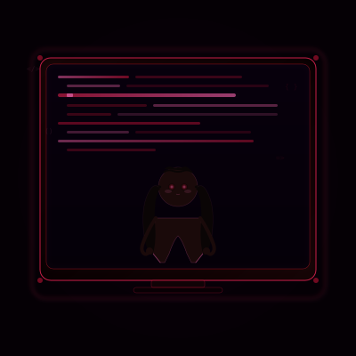

  

 

<!-- SOCIAL BUTTONS -->

  
  
  
  
  

  

 

<!-- ZIG-ZAG SECTION 1: LEFT IMAGE (KURUMI) | RIGHT CONTENT (ABOUT ME) -->
<table width="100%" border="0" cellpadding="0" cellspacing="0" style="border-collapse: collapse;">
  <tr>
    <!-- LEFT: Kurumi SVG (Image) -->
    <td width="42%" style="padding: 10px; vertical-align: middle;">
      

        
      

    </td>
    <!-- RIGHT: About Me (Text) -->
    <td width="58%" style="padding: 10px; vertical-align: middle;">
      

        

          ✦ TENTANG SAYA
        

        

          Halo! Saya <strong>Rhan (Ehan)</strong>, seorang Fullstack Developer berbakat sekaligus siswa sekolah menengah yang memiliki gairah tinggi dalam pengembangan perangkat lunak dan arsitektur backend yang clean. Saya senang memecahkan masalah kompleks dan membangun aplikasi yang efisien, skalabel, serta berkinerja tinggi.
        

        

          
◆ <strong>Status:</strong> Pelajar & Developer Aktif

          
◆ <strong>Fokus:</strong> Clean Architecture & API Design

          
◆ <strong>Keahlian:</strong> Laravel · Golang · React · Node.js

        

        

          

            Semangat & Passion
            99%
          

          

            

          

        

      

    </td>
  </tr>
</table>

 

<!-- ZIG-ZAG SECTION 2: LEFT CONTENT (CURRENT FOCUS) | RIGHT IMAGE (CODING) -->
<table width="100%" border="0" cellpadding="0" cellspacing="0" style="border-collapse: collapse;">
  <tr>
    <!-- LEFT: Current Focus & Goals (Text) -->
    <td width="58%" style="padding: 10px; vertical-align: middle;">
      

        

          ⚡ FOKUS SAAT INI
        

        

          Saat ini saya terus memperdalam keahlian di bidang pengembangan backend dengan performa tinggi, penerapan Clean Architecture, serta pembuatan antarmuka modern yang responsif dan interaktif.
        

        

          <!-- Laravel Progress -->
          

            

              Laravel & Ecosystem
              85%
            

            

              

            

          

          <!-- Golang Progress -->
          

            

              Golang Backend Development
              60%
            

            

              

            

          

          <!-- React Progress -->
          

            

              React & Modern UI (TailwindCSS)
              70%
            

            

              

            

          

          <!-- Clean Architecture Progress -->
          

            

              Clean Architecture & Design Patterns
              90%
            

            

              

            

          

        

      

    </td>
    <!-- RIGHT: Coding SVG (Image) -->
    <td width="42%" style="padding: 10px; vertical-align: middle;">
      

        
      

    </td>
  </tr>
</table>

 

<!-- ZIG-ZAG SECTION 3: LEFT IMAGE (CHIBI) | RIGHT CONTENT (PROJECTS & TECH) -->
<table width="100%" border="0" cellpadding="0" cellspacing="0" style="border-collapse: collapse;">
  <tr>
    <!-- LEFT: Chibi SVG (Image) -->
    <td width="40%" style="padding: 10px; vertical-align: middle;">
      

        
      

    </td>
    <!-- RIGHT: Projects & Tech Stack (Content) -->
    <td width="60%" style="padding: 10px; vertical-align: middle;">
      

        

          🚀 PROYEK UTAMA
        

        <!-- Projects Grid -->
        

          

            
S

            

              <strong style="color: #ff69b4; font-family: sans-serif; font-size: 14.5px;">Smart Presence</strong>
              
Sistem absensi modern, akurat, dan manajemen kehadiran terintegrasi.

            

          

          

            
E

            

              <strong style="color: #ff69b4; font-family: sans-serif; font-size: 14.5px;">Expense Tracker</strong>
              
Aplikasi pencatatan dan pengelolaan keuangan pribadi yang informatif.

            

          

          

            
A

            

              <strong style="color: #ff69b4; font-family: sans-serif; font-size: 14.5px;">AI Second Brain</strong>
              
Asisten AI personal untuk manajemen basis pengetahuan secara pintar.

            

          

        

        <!-- Tech Stack Badge Area -->
        

          
TEKNOLOGI DAN ALAT

          

            
            
            
            
            
            
            
          

        

      

    </td>
  </tr>
</table>

 

<!-- QUOTE OF THE DAY -->

  
"

  

    Setiap baris kode adalah detak jam yang menentukan masa depan. Mari kita bangun sesuatu yang luar biasa, satu baris kode demi satu baris kode.
  

  

  
— EHAN

 

<!-- GITHUB STATS DASHBOARD (TWO-COLUMN GRID) -->
<table width="100%" border="0" cellpadding="0" cellspacing="0" style="border-collapse: collapse;">
  <tr>
    <td width="50%" style="padding: 10px; vertical-align: top;">
      

        

          📊 GITHUB STATS
        

        
      

    </td>
    <td width="50%" style="padding: 10px; vertical-align: top;">
      

        

          💻 BAHASA TERPOPULER
        

        
      

    </td>
  </tr>
</table>

 

<!-- GITHUB TROPHIES -->

  

    🏆 GITHUB TROPHIES
  

  

 

<!-- STREAK TRACKER -->

  

    🔥 STREAK TRACKER
  

  

 

<!-- CONTRIBUTION GRAPH -->

  

    📈 GRAFIK KONTRIBUSI
  

  

 

<!-- CONTRIBUTION SNAKE ANIMATION -->

  

    🐍 KONTRIBUSI SNAKE
  

  <picture>
    <source media="(prefers-color-scheme: dark)" srcset="https://raw.githubusercontent.com/ehanz12/ehanz12/output/snake.svg" />
    
  </picture>

 

<!-- FOOTER -->

 

  
    EHAN — Fullstack Developer Portfolio
  

  
    dibuat dengan ❤ menggunakan PHP · JavaScript · Go
  

